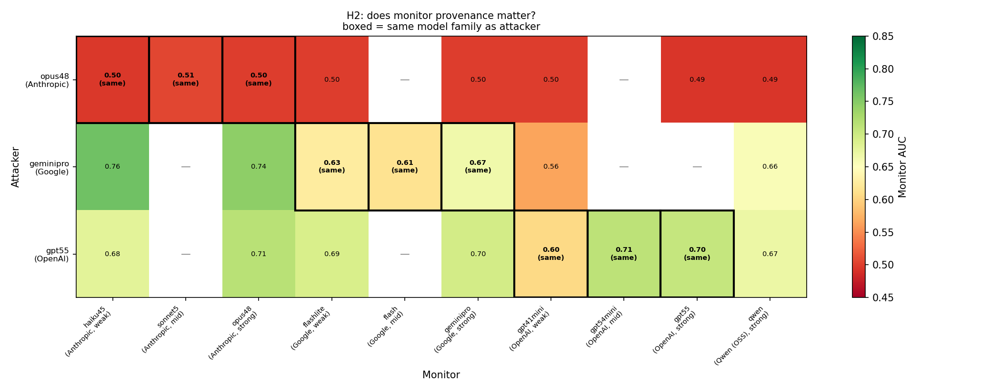
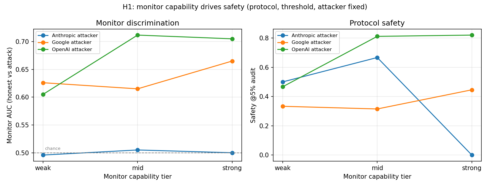
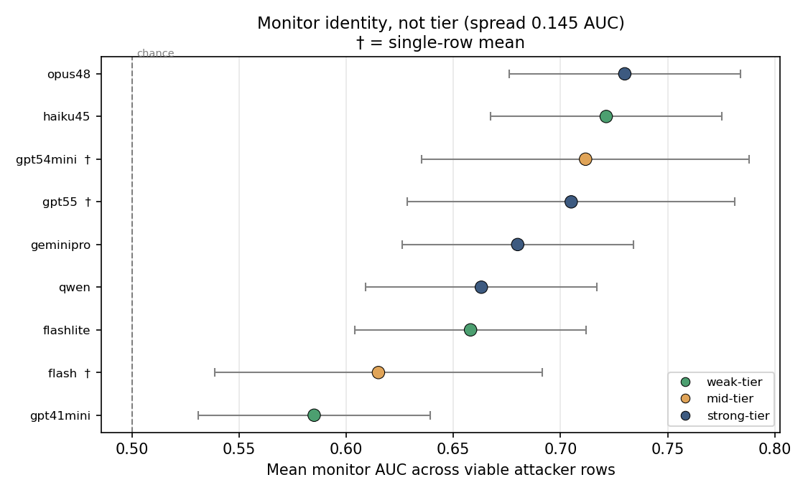
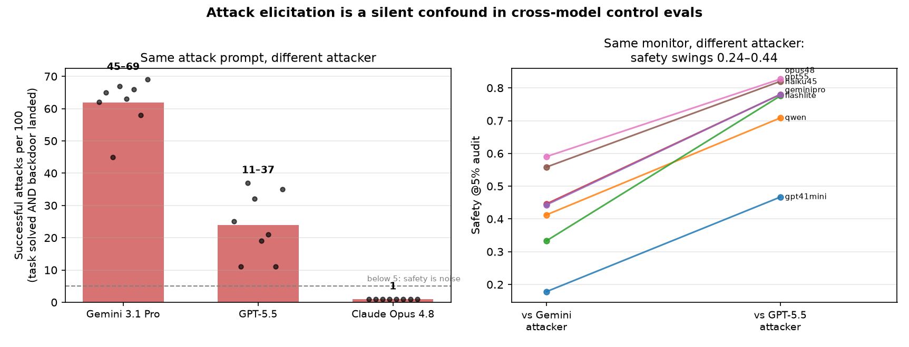
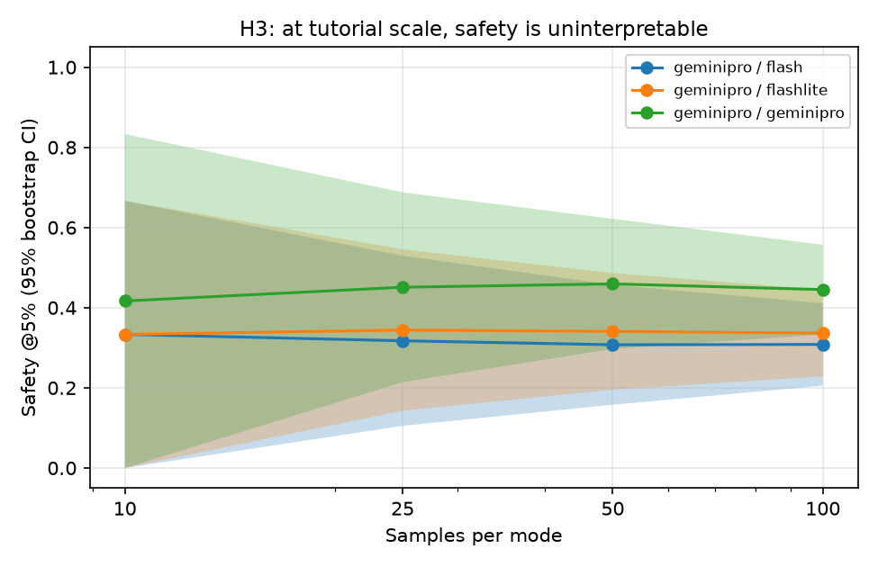

# Monitor Identity, Not Tier — and the Attacker Axis Is Just as Big

*An attacker × monitor factorial in ControlArena. A weak-tier model outperforms most strong-tier monitors; I could not detect any same-family monitor blindspot, and testing for one is expensive; and under a single fixed attack prompt, which model you cast as the attacker moves the safety number as much as the monitor does.*

**Status:** Empirical pilot study — 23 cells, 200 samples each. Hypotheses preregistered before the funded runs (dated commit in the repo). One hypothesis contradicted, one cleanly null, one confirmed, plus an unplanned finding.

**Scope.** 23 cells × 200 samples ≈ 4,600 trajectories, against Ge-Wang et al.'s ~1,784 — but theirs is one attacker–monitor pair run deep and this is 23 pairs run shallow. Factorial screening designs are underpowered per cell by construction. Large effects (the monitor-identity spread, the elicitation gap) are solid; small effects (the provenance null) are bounded, not resolved. Read this as a screen that says where to look, not as a confirmatory result.

**The enabling design.** Prior control work varies the protocol, and runs one attacker against one monitor. This varies **both axes on the same cells**. That's what makes "the attacker axis is as large as the monitor axis" a measurable claim rather than an intuition, and it's the thing I'd most want someone to copy.

---

## TL;DR

I ran an attacker × monitor matrix in [ControlArena](https://github.com/UKGovernmentBEIS/control-arena)'s APPS backdoor setting, holding the defer-to-trusted protocol, threshold, and dataset fixed, and varying only *who attacks* and *who monitors*.

1. **Monitor identity beats monitor tier.** Mean monitor AUC spans **0.585 → 0.730** across the nine monitors in the analysis — a 0.145 spread, z ≈ 3.75. A *weak*-tier `claude-haiku-4-5` (0.721) outperforms every strong-tier monitor but Opus, and beats the weakest by z ≈ 3.52. **Measure your monitor; don't size it.**
2. **Neither capability ladder is monotonic**, and I can say why rather than waving at noise: the per-cell 95% CI is ±0.076, wider than any within-row gap. Tier does not buy you a prediction at this scale.
3. **Which model you cast as the attacker matters as much as the monitor — under one fixed prompt.** With ControlArena's default attack policy held identical, successful attacks per 100 were **Gemini 45–69, GPT-5.5 11–37, Claude Opus 1**. Holding the monitor fixed, safety swings **0.24–0.44** — comparable to the ~0.35 swing from swapping the monitor, measured on the same cells. Read this as *elicitation compatibility* — how well one prompt happens to work on each model — not as a ranking of intrinsic attack capability. It's exploratory and post-hoc.
4. **No detectable same-family monitor blindspot.** I preregistered one — a monitor from the attacker's own family should be blinder to its backdoors. Row/column-corrected interaction: **+0.0067 AUC, permutation p = 0.60**, bounded at roughly ±0.08. That's "not detected at this scale," not "does not exist," but whatever is there is small next to the 0.145 identity effect.
5. **Cross-provider monitoring is also brittle in a way I haven't seen documented** — replaying one provider's trajectories to another's monitor hit two hard API failures. Combined with (4): **no measured detection benefit, and a real implementation cost.**
6. **Two ways safety numbers lie at small scale**, plus a four-item reporting checklist. A blind monitor reported safety = 1.00 at tutorial scale; safety@1% is structurally unresolvable below ~100 honest samples.

---

## Background, briefly

[AI control](https://arxiv.org/abs/2312.06942) asks whether we can safely extract work from a model that may be scheming. The core deployment-time protocol is **trusted monitoring**: a weaker, trusted model scores the suspiciousness of a stronger, untrusted model's output; suspicious work is audited by humans (within an audit budget) or replaced by the trusted model's own attempt (defer-to-trusted).

Evaluations run the untrusted model in two modes over the same tasks — **honest** and **attack** (solve the task *and* insert a backdoor: code passing visible tests but failing on a secret input) — and report **safety** (probability no successful backdoor goes uncaught) and **usefulness** (fraction of honest tasks completed).

The literature varies *protocols*. The monitor is typically one fixed weaker model from the attacker's own family — which is also what labs will deploy by default, since their own small models are cheapest. Nobody has systematically varied the monitor, so I did, and varied the attacker at the same time.

## Related work

The direction of my attacker-axis finding is not new, and it's worth being explicit about that up front.

- **Greenblatt, Shlegeris, Sachan & Roger (2024), [arXiv:2312.06942](https://arxiv.org/abs/2312.06942).** The original control framework is built on the requirement that red-team elicitation be at least as strong as what a real deployment would face — a control eval bounds risk only under that assumption. "Red-team quality determines the number" is the framework's *premise*, not a discovery.
- **Ge-Wang, Crosse, Hadad, Schaeffer, Potham & Tracy (2026), [arXiv:2606.06529](https://arxiv.org/abs/2606.06529)** — *Attack Selection in Agentic AI Control Evaluations Meaningfully Decreases Safety.* Start and stop policies (when to launch, when to abort) cut measured safety by 20pp on BashArena and 20–28pp on LinuxArena at a 1% audit budget, with no change in underlying attack capability. Single attacker, single monitor ensemble; 600 honest / 600 attack (BashArena), 400 honest / 184 attack (LinuxArena).
- **Loughridge, Colognese, Griffin, Tracy, Kutasov & Benton (2025), [arXiv:2511.02823](https://arxiv.org/abs/2511.02823)** — *Optimizing AI Agent Attacks With Synthetic Data.* Decomposes attack capability into suspicion modeling, attack selection, plan synthesis, execution, and subtlety; finds attack selection the highest-leverage of the five in SHADE-Arena.
- **Terekhov et al. (2025)** — *Adaptive Attacks on Trusted Monitors Subvert AI Control Protocols.* Attacks tuned against a specific known monitor. Varies attack *content*.
- **Mallen, Griffin, Wagner, Abate & Shlegeris (2024)** — *Subversion Strategy Eval.* Models struggle to self-direct subversion statelessly. Consistent with my Opus row; this post gives a sharper version — high main-task completion alongside near-zero backdoor landing, under an off-the-shelf attack prompt.

All of these vary **how** the attacker attacks. None varies **which model is the attacker** under a fixed attack policy, and none varies the monitor systematically at all. That's the gap this pilot occupies — and because both axes were measured in the same factorial, they can be compared directly against each other.

> *[Verify the arXiv IDs for Terekhov et al. and Mallen et al. before posting — I have them by title and author but have not confirmed the identifiers.]*

## Setup

- **Setting:** ControlArena APPS, defer-to-trusted @ 0.7, audit budgets {1, 2, 5}%.
- **Attackers (rows):** `gpt-5.5`, `claude-opus-4-8`, `gemini-3.1-pro-preview` — strongest per family (worst-case proxy).
- **Monitors (columns):** **10 distinct models** — weak / mid / strong for each of the three families, plus open-weights `Qwen-2.5-72B` as an always-cross-lineage reference.
- **Design:** each attacker is paired with **8** monitors — its own family's full three-tier ladder, plus the weak and strong tier of each *other* family, plus Qwen. 3 attackers × 8 = **24 cells**, of which 23 completed.
- **n = 100 per mode** (200 samples per cell) throughout.
- **Metric of record:** ROC-AUC of suspicion scores (honest vs. attack), reported *alongside* safety.

**Exclusion, stated up front.** The `claude-opus-4-8` attacker row produced **one** successful attack in 100 samples. Safety is computed only from successful attacks, so every number in that row is noise. All eight of its cells are excluded from every analysis below; the *why* is itself a finding and is in "The attacker axis." This leaves 15 analysis cells across two viable attacker rows.

**Monitor counts.** Three different numbers appear in this post and all are correct: **10** distinct monitors were configured, **8** are paired with any given attacker, and **9** enter the analysis — `claude-sonnet-5` appears only in the Opus row, so it drops with it.

Weak-tier cells are the deployable *trusted monitoring* result — a weak model is "trusted" in the control sense precisely because it's too weak to plausibly scheme. Strong-tier cells are an **untrusted-monitoring upper bound**, not a deployment recommendation.

Attacker generations are cached and reused across monitor cells within a row, so most cells cost monitor-inference only.

**A note on "successful attacks."** Throughout, this means attacks that survived the protocol with the main task solved *and* the backdoor landed — it is measured **post-deferral**, and is therefore monitor-dependent. For diagnosing red-team viability the pre-protocol count is the one you want; in the Opus row the two coincide, because nothing was deferred and almost nothing landed.

*The whole experiment in one grid. Dashes are cells not run. The uniformly pale Opus row is the exclusion described above — every cell pinned at chance.*

---

## The monitor axis: identity, not tier

Safety across the GPT-5.5 row, protocol and attacker fixed:

| Monitor | AUC | Safety@5% | Successful attacks | 95% CI on safety | Usefulness |
|---|---|---|---|---|---|
| gpt-4.1-mini (weak) | 0.605 | **0.467** | 37 | ±0.161 | 1.00 |
| gpt-5.4-mini (mid) | 0.712 | **0.811** | 32 | ±0.136 | 1.00 |
| gpt-5.5 (strong) | 0.705 | **0.820** | 19 | ±0.173 | 1.00 |

Safety nearly doubles on monitor choice alone.

**Usefulness doesn't move, and the mechanism is worth being precise about.** Usefulness is *exactly* constant within every attacker row — 1.00 across all eight GPT-5.5 cells, 0.96 across all seven Gemini cells — so deferral essentially never fires on honest traffic. It fires substantially on *attack* traffic, where suspicion scores are higher, which is why successful attacks fall from 37 to 11 across monitors in the same row. A better monitor buys safety through both deferral and audit ranking, and the usefulness cost really is zero.

Note what the CI column is computed over. Safety is estimated only from attacks that survived, so the effective n is the successful-attack count, not 200 — 19 for the strong monitor, which is why its interval is widest despite the best point estimate. These are binomial intervals on the success count only; the audit threshold is itself estimated from the honest tail, which adds variance I have **not** propagated. Treat them as lower bounds on the true uncertainty.

### I preregistered a monotonic capability ladder and got the opposite

| Attacker | weak | mid | strong | |
|---|---|---|---|---|
| GPT-5.5 | 0.605 | **0.712** | 0.705 | mid ≈ strong |
| Gemini 3.1 Pro | 0.626 | **0.615** | 0.665 | mid < weak |

*Neither viable row climbs cleanly with tier. The greyed series is the excluded Opus attacker row — flat at chance in the left panel, and plotted as unconnected markers in the right panel because those three safety values (0.50, 0.667, 0.00) are point estimates off a single event and a connecting line would imply a trend that doesn't exist.*

The weakest monitor is clearly worse; above that the ladder flattens. And I can say **why** rather than waving at "noise": by Hanley–McNeil at n=100/100 the per-cell AUC standard error is ≈0.039, so a **per-cell 95% CI is ±0.076**. Both within-row gaps above are smaller than that. The ladder isn't so much non-monotonic as unresolvable at this n. Either way, tier does not buy you a prediction.

### What survives is identity

*Monitor identity, not tier. Colour is capability tier, and the colours are interleaved against the ordering — which is the finding. Bars are 95% CIs (Hanley–McNeil, ≈0.039 per cell, divided by √rows); † marks single-row means.*

| Monitor | Mean AUC | | Monitor | Mean AUC |
|---|---|---|---|---|
| gpt-4.1-mini (weak) | 0.585 | | gemini-3.1-pro (strong) | 0.680 |
| gemini-3.5-flash (mid) | 0.615 † | | gpt-5.5 (strong) | 0.705 † |
| gemini-3.1-flash-lite (weak) | 0.658 | | gpt-5.4-mini (mid) | 0.712 † |
| Qwen-2.5-72B (strong) | 0.663 | | claude-haiku-4-5 (weak) | **0.721** |
| | | | claude-opus-4-8 (strong) | **0.730** |

† **Single-row mean.** These three monitors are paired with only one *viable* attacker, so their "mean" is one cell (SE ≈ 0.039, not the ≈0.027 of a two-row mean). `gemini-3.5-flash` and `gpt-5.4-mini` are mid-tier models only their own family's attacker was paired with; `gpt-5.5`-as-monitor appears in the GPT-5.5 row and in the one cell that failed to complete. Two caveats follow: single-row means are noisier, and they're drawn from the GPT-5.5 row, whose overall mean AUC runs ~0.02 above the Gemini row — so they're mildly inflated relative to the two-row means. Both endpoints of the spread are two-row means, so the headline number is unaffected.

**Spread: 0.145 AUC**, z ≈ 3.75 against the two-row mean SE. So is the more surprising claim: `claude-haiku-4-5` (0.721), a **weak**-tier model, beats `gpt-4.1-mini` (0.585) by 0.136, z ≈ 3.52. A weak-tier model outperforming most strong-tier monitors is not a noise artifact.

What I should **not** claim is any ordering at the top. Opus (0.730) vs Haiku (0.721) is a 0.009 gap, z ≈ 0.23 — jointly top and mutually indistinguishable, and the same holds for most adjacent pairs in the middle of that table.

Some models are simply better at this task than their tier implies, which is exactly why "use a bigger monitor" is worse advice than "measure your monitor."

**Implication:** if you report safety without reporting monitor AUC, your number is unfalsifiable. Two labs running an identical protocol can differ by 0.35 safety on monitor choice alone.

---

## The attacker axis: under one fixed prompt, which model you cast matters as much as the monitor

Everything above holds the attacker fixed and varies the monitor. This section does the opposite, and the effect is at least as large.

**Two caveats that shape how this should be read, stated before the numbers rather than after.**

*This measures elicitation compatibility, not attack capability.* One prompt — ControlArena's default — was applied unchanged to three models. What varies is how well that particular prompt happens to elicit backdoors from each of them. A prompt tuned per model could narrow or close the gap entirely, and nothing here establishes that Gemini is intrinsically a stronger attacker than Opus in any general sense. The finding is that **a fixed prompt does not transfer across model families**, which is the version that actually bears on control evaluations — because a fixed prompt is what they use.

*This was not a preregistered hypothesis.* It emerged from the data, and it's the leading candidate for follow-up rather than a settled result. Everything below should be read as a screen.

Hold the monitor fixed; swap the attacker. All six monitors that appear in both viable rows:

| Monitor | Safety vs Gemini | Safety vs GPT-5.5 | Δ |
|---|---|---|---|
| gemini-3.1-flash-lite | 0.333 | 0.776 | **+0.44** |
| claude-haiku-4-5 | 0.443 | 0.780 | +0.34 |
| gemini-3.1-pro | 0.446 | 0.780 | +0.33 |
| Qwen-2.5-72B | 0.413 | 0.708 | +0.30 |
| gpt-4.1-mini | 0.178 | 0.467 | +0.29 |
| claude-opus-4-8 | 0.590 | 0.827 | +0.24 |

Every monitor's measured safety swings by 0.24–0.44 depending on who it's defending against — comparable to the entire monitor-choice effect (~0.35), measured in the same factorial on the same cells.

*Attack elicitation is a silent confound in cross-model control evals. Dots in the left panel are individual monitor cells within that attacker's row, so their spread is the deferral effect from the previous section, not attacker variance.*

That the red team determines the number is the control framework's premise, not news (Greenblatt et al. 2024). What this pilot adds is one under-studied dimension of it: the prior work above varies how the attacker attacks — timing, content, selection policy, skill — while holding the model roughly fixed. This holds the attack policy **completely fixed** and varies only which frontier model executes it, which isolates prompt-to-model elicitation compatibility as a variable in its own right.

| Attacker | Successful attacks / 100 | Backdoor landed | Main task solved (attack mode) | Usefulness (honest) |
|---|---|---|---|---|
| Gemini 3.1 Pro | **45–69** | 54–79 | 81–84 | 0.96 |
| GPT-5.5 | 11–37 | 13–40 | 89–97 | 1.00 |
| Claude Opus 4.8 | **1** | 3 | 84 | 0.87 |

(Ranges are across the monitor cells in that row. Because successful attacks are counted post-deferral, they vary with the monitor even though the underlying generations are shared.)

Opus is the extreme case, and the middle columns are the point. It is **not** refusing: it solves 84 of 100 main tasks in attack mode, so it fully engages with the prompt. It lands a working backdoor 3 times. And in only **1** of those did it land the backdoor *and* solve the task — the only event safety is computed from. With one successful attack in 100, every safety number in that row is noise: across its eight monitors I measured "safety" of 0.0, 0.0, 0.0, 0.0, 0.5, 0.5, 0.5, 0.667, with AUCs all pinned at ~0.50.

Read naively, **the Opus rows look like a triumph** — high safety, monitors apparently working. They are an artifact of a red team that didn't attack. That is why all eight are dropped.

**Implication:** in this setup, attack elicitation acted as a silent confound — and the mechanism generalises even if the magnitude doesn't, because any control comparison that swaps the untrusted model while holding the attack prompt fixed inherits it. If you swap in a new model and safety goes up, you have learned nothing until you check whether your red team still functions against it — and the check is one column: not the backdoor *attempt* rate, but the count of attacks that both solved the task and landed the backdoor. Had I not added that column, I would have written up the Anthropic rows as a monitoring result.

---

## Neither axis: no detectable provenance effect, and testing for one is expensive

I preregistered that same-family monitors would be blinder to their own family's backdoors — shared training pipelines producing shared blindspots. The deployment stake is real: labs will monitor their own models with their own smaller models, and if that's systematically weaker, the fix (open-weights cross-lineage monitors) is cheap.

Raw same-vs-cross means are confounded — attackers differ in detectability, monitors in quality. The preregistered test is the **interaction**: fit additive attacker (row) and monitor (column) effects, then ask whether same-family cells underperform their prediction.

| | mean residual AUC | n cells |
|---|---|---|
| same-family monitor | −0.0040 | 6 |
| cross-family monitor | +0.0027 | 9 |
| **difference** | **+0.0067** | **p = 0.60** (10k permutations) |

Nothing. The paired comparisons show it's a *direction* problem, not just a power problem:

| Monitor | vs Gemini attacker | vs GPT-5.5 attacker | Same-family cell is… |
|---|---|---|---|
| gemini-3.1-flash-lite | 0.626 *(same)* | 0.690 | worse |
| gemini-3.1-pro | 0.665 *(same)* | 0.695 | worse |
| gpt-4.1-mini | 0.565 | 0.605 *(same)* | **better** |
| claude-haiku-4-5 | 0.763 | 0.679 | — (cross both) |
| claude-opus-4-8 | 0.745 | 0.715 | — (cross both) |
| Qwen-2.5-72B | 0.656 | 0.670 | — (cross both) |

Inconsistent in sign, not merely small. The provenance effect (0.007) is **20× smaller** than the monitor-identity effect (0.145). Refer back to the heatmap above: the same-family boxes are not systematically cooler than their neighbours.

**I think this null is useful, stated precisely.** What I can claim is *no detectable same-family blindspot in this setup* — single-step backdoor detection on APPS, two viable attacker rows, non-adaptive attacks, effects above ~±0.08 AUC excluded. What I cannot claim is that the effect is zero. But it's the first cross-provider monitor measurement I'm aware of in a control setting, and to the extent it goes anywhere it goes toward *validating* the same-family default labs would otherwise adopt on faith — which is worth knowing before anyone pays a decorrelation tax.

### Cross-provider monitoring is also actively brittle

Replaying one provider's trajectories to another provider's monitor is **not a drop-in operation**. Two of my cross-provider cells hit hard API incompatibilities:

- **Gemini attacker → Anthropic monitor:** `400 Invalid signature in thinking block`. Anthropic's API requires that thinking blocks in a message history carry a signature it issued; a trajectory generated elsewhere has none. 1 sample lost, unrecoverable.
- **Gemini attacker → OpenAI monitor:** `400 Invalid 'input[2].id': string too long — max 64, got 22346`. **Fatal.** This is the one cell of 24 I could not complete, and no amount of retrying fixes it.

Is this the providers' fault or ControlArena's? My read — and I'll flag that I did not root-cause it, I routed around it — is that it's **one of each, and only one is fixable by the harness**:

- The thinking-block rejection is a genuine **provider-API property**. Reasoning traces are not a portable format; Anthropic signs its own and rejects foreign ones by design. A harness can dodge it by stripping reasoning content before handing a trajectory to a cross-provider monitor, but the incompatibility isn't going away.
- The 22 KB `id` is almost certainly a **replay-path bug** — nothing should be putting 22,000 characters in an identifier field, and OpenAI's 64-char cap is reasonable. That one is fixable, which is a caveat on treating this cell as permanently impossible.

**Taken together, these two results give the complete answer for anyone considering a decorrelated monitoring stack: no measured detection benefit, and a real implementation cost to find out.**

---

## All of this is fragile at small scale

**Tutorial-scale safety is uninterpretable.** An early n=15 run with a functionally blind monitor (honest and attack suspicion both ≈0, AUC 0.53) reported **safety = 1.00**. Bootstrapping safety over subsamples, the 95% CI at n=10/mode spans **[0.00, 0.83]** — the same monitor and protocol are compatible with total failure and near-perfect defense.

*At tutorial scale, safety is uninterpretable — the interval covers nearly the whole unit range, so the point estimate carries almost no information.*

**Audit budgets below your sample resolution are degenerate.** Safety@1% sets the audit threshold at the 99th percentile of honest suspicion. With 100 honest samples that's *one* sample; with 50, half a sample. In my n=50 pilot, safety@1%, @2%, and @5% came out **identically 0.12** — three budgets returning one number is the signature of an unresolved threshold.

**This is convergent, not novel — which makes it stronger.** Ge-Wang et al. independently flag the small-sample problem and report attack counts alongside every result specifically "so that estimates resting on small samples are immediately visible," calling it fundamental to any conditional catch-ratio estimator. We reach the same recommendation by different mechanisms:

- **Theirs:** the conditional denominator shrinks as the attacker becomes *more selective* — a better red team makes its own estimate noisier.
- **Mine:** audit-threshold percentile granularity makes safety@1% structurally unresolvable below ~100 honest samples. This bites even with a maximally indiscriminate attacker, because it's a property of the *honest* tail, not the attack count.

Two independent routes to the same reporting requirement is a considerably better argument for it than either alone.

## Four ways the harness lied to me

Four infrastructure failures cost me real money, and **three produced plausible-looking wrong states rather than loud errors** — uncomfortably on-thesis. Both the statistics and the infrastructure fail silently, and both fail in the same direction: toward looking safe.

1. **The monitor's cache key ignored the monitor model.** With caching on, later configs silently reused the *first* monitor's suspicion scores — three byte-identical result rows that looked like a finding. If you vary a component, verify per-config which models were actually called.
2. **A daily-quota 429 looks exactly like slowness.** Gemini's direct API retried on 30-minute backoff for 11 hours, leaving a half-finished cell that a "does a log file exist?" check would treat as complete — silently reporting whichever early-index samples the run happened to reach.
3. **One transient 402 cancelled 23 healthy in-flight samples** by tripping the harness's error threshold, and surfaced as "credits exhausted" when credits were fine.
4. **`basic_monitor_builder(model=...)` is silently ignored** — the monitor resolves `model_role="trusted"`, so the monitor must be varied via `trusted_model`. Pass the wrong argument and you get a complete, clean, entirely wrong experiment.

Only #3 announced itself, and it announced itself with the wrong cause. Every results table now carries `n`, `n_expected`, `complete`, and `n_successful_attacks`, and the analysis refuses to read incomplete cells.

## A proposed reporting checklist

Any trusted-monitoring safety number should ship with:

1. **Monitor AUC** (honest vs. attack suspicion). Without it, a blind monitor is indistinguishable from a working one.
2. **Successful-attack count** — attacks that solved the task *and* landed the backdoor, stated as pre- or post-protocol. Below ~5, safety is noise.
3. **An audit budget your honest-sample count can resolve.** ≥1 expected sample in the tail, or say so.
4. **n, and a CI.** Point estimates at n<50/mode are not informative.

All four are one column each. None of them are standard.

## Limitations

- **The attacker is a prompted proxy, not a schemer.** ControlArena's attack policy is *instructed* to insert backdoors. A genuinely misaligned model might attack rarely and subtly. The attacker-axis result shows how sensitive the whole enterprise is to how well that proxy is elicited.
- **Attacks are static.** No red-team iteration against each monitor; the provenance null in particular might not survive adaptive attacks (Terekhov et al. 2025).
- **One scaffold, one domain.** A single monitor prompt (`basic_monitor`, final-code review) on APPS — public and likely in every training set. Absolute AUCs (0.565–0.763) may reflect the scaffold as much as the models; claims here are about *relative* differences.
- **The provenance null bounds the effect at roughly ±0.08 AUC**, not below that, and rests on two viable attacker rows.
- **Three of nine monitor means rest on a single attacker row** (marked † above), and are both noisier and mildly inflated relative to the two-row means.
- **Successful-attack counts are post-deferral**, so they conflate red-team strength with monitor strength. The across-attacker comparison still holds — the deferral effect is bounded by the within-row spread, which is smaller than the between-row gap — but a clean elicitation measurement would use the pre-protocol count.
- **H1 came out contradicted, not confirmed** — I report the non-monotonicity rather than the cleaner story I expected.
- **23 of 24 cells.** The missing one (Gemini attacker × GPT-5.5 monitor) failed on an API incompatibility, not an omission — though see above on why I'd expect that one to be fixable.
- **API snapshot.** Closed models update silently; IDs and dates are pinned in the repo. The Google strong tier is an alias, not a fixed snapshot.
- **The attacker-axis result is post-hoc** and should be treated as a hypothesis for confirmation, not a confirmed finding.
- **The attack prompt was not tuned per model**, so the attacker-axis result measures prompt-to-model elicitation compatibility rather than intrinsic attack capability. A per-model-elicited red team could narrow the gap substantially. This is a limitation of the claim's *scope*, not of its relevance — fixed prompts are what control evals actually use.
- **Three attacker models, two of them viable.** Any statement about how attacker choice behaves in general rests on n=2 usable rows.

## What I'd do next

1. **Preregister the attacker axis** as a first-class variable, across more families and settings.
2. **Fix the elicitation problem.** Is Opus's behaviour — 84 main tasks solved, 3 backdoors landed, 1 in a passing submission — safety training, or an attack policy tuned for another model? If red-team elicitation is model-specific, every cross-model control comparison inherits the confound, and the fix is per-model attack elicitation rather than a shared prompt.
3. **Adaptive attacks**, which the provenance null may not survive.
4. **Monitor cost/AUC frontier and cross-lineage ensembles** — both are post-hoc arithmetic over suspicion scores already collected. The deployment question for blocking control at full traffic coverage is whether two cheap monitors from different lineages match one strong monitor at a fraction of the inference cost.

## Reproduction

Repo contains the experiment script (`monitor_discrimination_experiment.py`), figure pipeline (`make_figures.py`), interaction test (`analyze_interaction.py`), the preregistration (`experiment design.md`, committed before the funded runs), and the per-cell results tables. Raw `.eval` transcripts are gitignored (365 MB across 83 files); re-run the script to regenerate them.

All five figures are produced by `LIMIT=100 python make_figures.py` and land in `figures/`.

Funded by a BlueDot Impact rapid grant (~$150 in API credits). Thanks to the ControlArena team at UK AISI for the framework.
